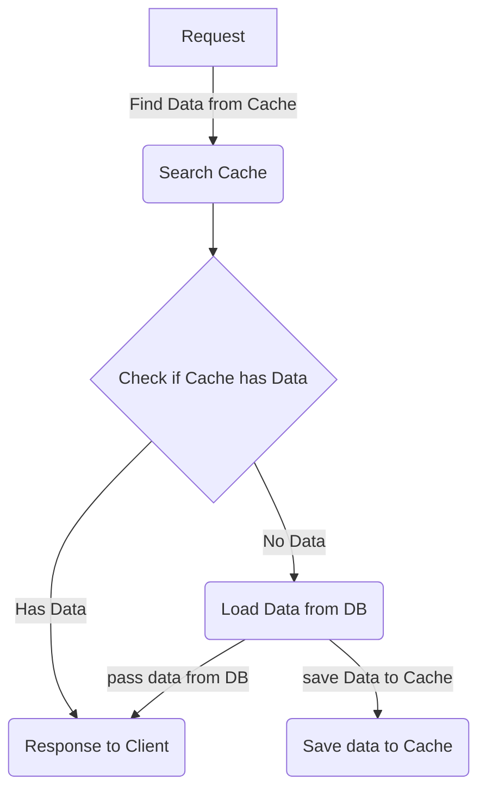

# gin_framework_learn

This repo is for learn for gin framework

## GIN 專案設定
- [x] 學習 https://www.youtube.com/watch?v=-IvZBkLh_Lo

### 專案初始化

透過 go mod 初始化一個新專案 --> dependency 會管理在 go.mod

### 安裝 gin 

go get github.com/gin-gonic/gin

### 建立 router 邏輯

設定 main.go 在 package main 如下

```go=
package main

import "github.com/gin-gonic/gin"

func main () { // entry point
    // create router
    router := gin.Default()

    router.Run(":8000") // <--- setup run with port 8000
}
```

### GET/POST route

透過 router 可以設定 GET/POST route

```go=
...
/** 
 GET /ping
**/
router.GET("/ping", func (c *gin.Context) {
    c.JSON(200, gin.H{
      "message": "ping",
    })
})
/** 
 POST /ping/:id
**/
router.POST("/ping/:id", func (c *gin.Context) {
    id := c.Param("id")
        c.JSON(200, gin.H{
        "id": id,
    })
})
...
```
## 透過 router.Group 實作 User API
- [x] 學習 https://www.youtube.com/watch?v=gaBwPaQjxPY

### 建立 User POJO

```go=
package pojo

type User struct {
    Id       int `json:"UserId"`
    Name     string `json:"UserName"`
    Password string `json:"UserPassword"`
    Email    string `json:"UserEmail"`
}
```
***Notice*** : json 後面帶入的 key 是 JSON 物件的 key

### 建立 User Service

```go=
package service

import (
    "web/pojo"
    "net/http"
    "github.com/gin-gonic/gin"
)

var userList = []pojo.User{} // pojo
// GET /users
func FindAllUser(c *gin.Context) {
    c.JSON(http.StatusOK, userList)
}
// POST /users
func PostUser(c *gin.Context) {
    user := pojo.User{}
    // parse context body into pojo
    err := c.BindJSON(&user)
    if err != nil {
    c.JSON(http.StatusNotAcceptable, "Error:" + err.Error())
    return
    }
    userList = append(userList, user)
    c.JSON(http.StatusCreated, "Successfully created")
}
```

### 建立 Group for user route

```go=
package src

import (
	"web/service"
	"github.com/gin-gonic/gin"
)

func AddUserRouter(r *gin.RouterGroup) {
	user := r.Group("/users")
	user.GET("/", service.FindAllUsers)
	user.POST("/", service.PostUser)
}
```

### 加入 main Router

```go=
package main

import (
	"web/src"

	"github.com/gin-gonic/gin"
)

func main() {
	router := gin.Default()
	v1 := router.Group("/v1")
	src.AddUserRouter(v1)
	router.Run(":8000")
}
```

## 建立 PUT/DELETE users

- [x] https://www.youtube.com/watch?v=tHxsLsNRHYs

### 新增 PUT/DELETE users service

```go=
...
// DELETE User
func DeleteUser(c *gin.Context) {
	userId, _ := strconv.Atoi(c.Param("id"))
	for idx, user := range userList {
		if user.Id == userId {
			userList = append(userList[:idx], userList[idx+1:]...)
			c.JSON(http.StatusOK, "Successfully delete")
			return
		}
	}
	c.JSON(http.StatusNotFound, "Delete Resource not found")
}  
...
// PUT user
func PutUser(c *gin.Context) {
	updatedUser := pojo.User{}
	err := c.BindJSON(&updatedUser)
	if err != nil {
		c.JSON(http.StatusBadRequest, "ParseError")
		return
	}
	userId, _ := strconv.Atoi(c.Param("id"))
	for key, user := range userList {
		if userId == user.Id {
			userList[key] = updatedUser
			log.Println(userList[key])
			c.JSON(http.StatusOK, "Success")
			return
		}
	}
	c.JSON(http.StatusNotFound, "Resource not found")
}
```
### 更新 user route

```go=
package src

import (
	"web/service"

	"github.com/gin-gonic/gin"
)

func AddUserRouter(r *gin.RouterGroup) {
	user := r.Group("/users")
	user.GET("/", service.FindAllUsers)
	user.POST("/", service.PostUser)
	user.DELETE("/:id", service.DeleteUser)
	user.PUT("/:id", service.PutUser)
}
```

## 加入 gorm

- [x] https://www.youtube.com/watch?v=Qe3ekoD_tcw

### 參考 gorm 官網

gorm.io

### 建立 DB 連線

Step 1: 建立 Config

```go=
package config

type Config struct {
	DBUser     string `json:"DBUser"`
	DBPassword string `json:"DBPassword"`
	DBPort     string `json:"DBPort"`
	DBName     string `json:"DBName"`
	DBHost     string `json:"DBHost"`
	Port       string `json:"Port"`
}
```

Step 2: 加入 dotenv 並且引入 autoload
```shell=
go get github.com/joho/godotenv
```
修改 main 如下
```go=
package main

import (
	"fmt"
	"log"
	"os"
	"web/config"
	"web/database"
	"web/src"

	"github.com/gin-gonic/gin"
	_ "github.com/joho/godotenv/autoload"
)

var Config = config.Config{}

func main() {
	router := gin.Default()
	Config.Port = os.Getenv("PORT")
	Config.DBPort = os.Getenv("DB_PORT")
	Config.DBPassword = os.Getenv("DB_PASSWORD")
	Config.DBUser = os.Getenv("DB_USER")
	Config.DBName = os.Getenv("DB_NAME")
	Config.DBHost = os.Getenv("DB_HOST")
	log.Printf("%v", Config)
	v1 := router.Group("/v1")
	src.AddUserRouter(v1)
	router.Run(fmt.Sprintf(":%s", Config.Port))
}
```
Step 3： 新增 DBConnect.go
```shell=
mkdir database
touch DBConnect.go
```

```go=
package database

import (
	"fmt"
	"log"
	"web/config"

	"gorm.io/driver/postgres"
	"gorm.io/gorm"
)

var DBconnect *gorm.DB

var err error

func GetDSN(config *config.Config) string {
	// "user=yuanyu password=gorm dbname=gorm port=9920 sslmode=disable TimeZone=Asia/Taipei"
	return fmt.Sprintf("host=%s user=%s password=%s dbname=%s port=%s sslmode=disable TimeZone=Asia/Taipei",
		config.DBHost, config.DBUser, config.DBPassword, config.DBName, config.DBPort,
	)
}
func DB(config *config.Config) {
	// https://github.com/go-gorm/postgres
	DBconnect, err = gorm.Open(postgres.New(postgres.Config{
		DSN:                  GetDSN(config),
		PreferSimpleProtocol: true, // disables implicit prepared statement usage
	}), &gorm.Config{})
	if err != nil {
		log.Fatal(err)
	}
}

```

Step 4: 把 DBConnect 以 goroutine 方式引入

```go=
package main

import (
	"fmt"
	"log"
	"os"
	"web/config"
	"web/database"
	"web/src"

	"github.com/gin-gonic/gin"
	_ "github.com/joho/godotenv/autoload"
)

var Config = config.Config{}

func main() {
	router := gin.Default()
	Config.Port = os.Getenv("PORT")
	Config.DBPort = os.Getenv("DB_PORT")
	Config.DBPassword = os.Getenv("DB_PASSWORD")
	Config.DBUser = os.Getenv("DB_USER")
	Config.DBName = os.Getenv("DB_NAME")
	Config.DBHost = os.Getenv("DB_HOST")
	log.Printf("%v", Config)
	go func() {
		database.DB(&Config)
	}()
	v1 := router.Group("/v1")
	src.AddUserRouter(v1)
	router.Run(fmt.Sprintf(":%s", Config.Port))
}

```

Step 5: 把存取邏輯放到 pojo

```go=
package pojo

import "web/database"

type User struct {
	Id       int    `json:"UserId"`
	Name     string `json:"UserName"`
	Password string `json:"UserPassword"`
	Email    string `json:"UserEmail"`
}

func FindAllUserService() []User {
	var users []User
	database.DBconnect.Find(&users)
	return users
}

func FindByUserId(userId int) User {
	var user User
	database.DBconnect.Where("id = ?", userId).First(&user)
	return user
}

```
Step 6: 建立 DB 與 Table

```sql=
CREATE DATABASE Demo;
```
```sql=
CREATE TABLE users (
    id int,
    name varchar(45),
    password varchar(45),
    email varchar(45),
    primary key(id),
);
```
```sql=
INSERT INTO users (id, name, password, email) VALUES 
(1, 'Wilson', '123468', 'Wilson@gmail.com'),
(2, 'tom', '123468', 'tom@gmail.com'),
(3, 'sherry', '123468', 'sherry@gmail.com');
```
STEP 7: 更新 service 與 router

```go=
...
// Get User
func FindAllUsers(c *gin.Context) {
	// c.JSON(http.StatusOK, userList)
	users := pojo.FindAllUserService()
	c.JSON(http.StatusOK, users)
}

func FindUserWithId(c *gin.Context) {
	id, _ := strconv.Atoi(c.Param("id"))
	user := pojo.FindByUserId(id)
	if user.Id == 0 {
		c.JSON(http.StatusNotFound, "Not found")
		return
	}
	log.Println("User ->", user)
	c.JSON(http.StatusOK, user)
}
...
```
```go=
package src

import (
	"web/service"

	"github.com/gin-gonic/gin"
)

func AddUserRouter(r *gin.RouterGroup) {
	user := r.Group("/users")
	user.GET("/", service.FindAllUsers)
	user.GET("/:id", service.FindUserWithId)
	user.POST("/", service.PostUser)
	user.DELETE("/:id", service.DeleteUser)
	user.PUT("/:id", service.PutUser)
}

```
## 新增 POST/DELETE/PUT users

- [x] https://www.youtube.com/watch?v=CO9HqCMmwlY

Step1: 新增 POST/DELETE/PUT users POJO

```go=
package pojo

import (
	"log"
	"web/database"
)

type User struct {
	Id       int    `json:"UserId"`
	Name     string `json:"UserName"`
	Password string `json:"UserPassword"`
	Email    string `json:"UserEmail"`
}

func FindAllUserService() []User {
	var users []User
	database.DBconnect.Find(&users)
	return users
}

func FindByUserId(userId int) User {
	var user User
	database.DBconnect.Where("id = ?", userId).First(&user)
	return user
}

func CreateUser(user User) User {
	database.DBconnect.Create(user)
	return user
}

func DeleteUser(userId int) bool {
	result := database.DBconnect.Where("id = ?", userId).Delete(&User{})
	return result.RowsAffected >= 1
}

func UpdateUser(userId int, user User) bool {
	log.Printf("%v, %v", userId, user)
	result := database.DBconnect.Model(&User{}).Where("id = ?", userId).Updates(user)
	return result.RowsAffected >= 1
}

```

Step2: 新增 POST/DELETE/PUT users services

```go=
package service

import (
	"log"
	"net/http"
	"strconv"
	"web/pojo"

	"github.com/gin-gonic/gin"
)

// Get User
func FindAllUsers(c *gin.Context) {
	// c.JSON(http.StatusOK, userList)
	users := pojo.FindAllUserService()
	c.JSON(http.StatusOK, users)
}

func FindUserWithId(c *gin.Context) {
	id, _ := strconv.Atoi(c.Param("id"))
	user := pojo.FindByUserId(id)
	if user.Id == 0 {
		c.JSON(http.StatusNotFound, "Not found")
		return
	}
	log.Println("User ->", user)
	c.JSON(http.StatusOK, user)
}

// Post User
func PostUser(c *gin.Context) {
	user := pojo.User{}
	err := c.BindJSON(&user)
	if err != nil {
		c.JSON(http.StatusNotAcceptable, "Error:"+err.Error())
		return
	}
	// userList = append(userList, user)
	newUser := pojo.CreateUser(user)
	c.JSON(http.StatusCreated, newUser)
}

// Delete User
func DeleteUser(c *gin.Context) {
	userId, _ := strconv.Atoi(c.Param("id"))
	isDeleted := pojo.DeleteUser(userId)
	if !isDeleted {
		c.JSON(http.StatusNotFound, "Delete Resource not found")
		return
	}
	c.JSON(http.StatusOK, "Successfully Delete")
}

func PutUser(c *gin.Context) {
	updatedUser := pojo.User{}
	err := c.BindJSON(&updatedUser)
	if err != nil {
		c.JSON(http.StatusBadRequest, "ParseError")
		return
	}
	userId, _ := strconv.Atoi(c.Param("id"))
	isUpdated := pojo.UpdateUser(userId, updatedUser)
	log.Printf("%v", isUpdated)
	if !isUpdated {
		c.JSON(http.StatusNotFound, "Update resource not found")
		return
	}
	c.JSON(http.StatusOK, updatedUser)
}

```

## 新增 defaultWriter, middleware logger 與 BasicAuth

- [x]  https://www.youtube.com/watch?v=UJfi3ppkqRk

### 設定 gin.DefaultWriter

把 log 寫入一個檔案

更新 main.go 如下

```go=
...
// setup logger
func setupLogging() {
	f, _ := os.Create("gin.log")
	gin.DefaultWriter = io.MultiWriter(f, os.Stdout)
}

func main () {
  setupLogging()
  ...
}
...
```

這樣做把 logger 透過 os.Create 產生一個 fileWriter

先把 os.Stdout 與 fileWriter 包裝成一個 io.Writer

在把 gin.DefaultWriter 指定到這個 io.Writer

這樣一來 gin.Router 接到 logger 除了寫入檔案外, 還有在 os.Stdout 印出執行結果

### 設定 middlewares Logger

透過 middleware 改寫 logger 格式

建立 middlewares/Logger.go

```go=
package middlewares

import (
	"fmt"

	"github.com/gin-gonic/gin"
)

func Logger() gin.HandlerFunc {
	return gin.LoggerWithFormatter(func(params gin.LogFormatterParams) string {
		return fmt.Sprintf("%s - [%s] %s %s %d \n",
			params.ClientIP,
			params.TimeStamp,
			params.Method,
			params.Path,
			params.StatusCode,
		)
	})
}
```

在 main func 內使用 router.Use 來套用

```go=
...
func main() {
  setupLogging()
  router := gin.Default()
  router.use(middlewares.Logger())
  ...
}
```
### basicAuth

BasicAuth 是指在 request header 做帳密驗證

這邊可以透過 gin.BasicAuth 還有 gin.Account 來設定

使用方式如下

```go=
func main() {
  ...
    router.Use(gin.BasicAuth(
    gin.Accounts{os.Getenv("BASIC_AUTH_USER"): os.Getenv("BASIC_AUTH_PASSWORD")})
    )
  ...
}
```

## Validator for input object

 - [x] https://www.youtube.com/watch?v=FUIxUsoTlMM
 - [x] https://www.youtube.com/watch?v=WRki5zeQ8L8

 [golang validator](https://pkg.go.dev/github.com/go-playground/validator/v10@v10.2.0#section-readme)
### 安裝 validator 套件

```shell=
go get github.com/go-playground/validator/v10
```

在要使用的 module 內 import

```go=
import "github.com/go-playground/validator/v10"
```
### 在要進行驗證的物件 加上 tag

在物件 field 有可以在[default tag lookup](https://pkg.go.dev/github.com/go-playground/validator/v10@v10.2.0#pkg-overview)找到一些可以用的tag

在原本 pojo.User 加入 tag

```go=
type User struct {
    Id       int    `json:"UserId" binding:"required"`
    Name     string `json:"UserName" binding:"gte=5"`
    Password string `json:"UserPassword" binding:"min=5,max=20"`
    Email    string `json:"UserEmail" binding:"required,email"`
}
```

keyword **binding** 用來指定 tag


### 實作字定義的 validator function

在 middlewares 新增 validator.go

```go=
package middlewares

import (
  "regexp"
  "github.com/go-playground/validator/v10"
)

func UserPassswd(field validator.FieldLevel) bool {
    if match, _ := regexp.MatchString(`^[A-Z]\w{4,10}$`, field.Field().String()); match {
       return true
    }
    return false
}

```
### 在 router 之前註冊 validator

在 main.go 加入註冊子定義的 validator

```go=
func main() {
    setupLogging()
    router := gin.Default()
    if v, ok := binding.Validator.Engine().(*validator.Validate); ok {
	v.RegisterValidation("userpasswd", middlewares.UserPassswd)
    }
    ...
}
```
把自訂義的 tag 加入 pojo.User

```go=
type User struct {
    Id       int    `json:"UserId" binding:"required"`
    Name     string `json:"UserName" binding:"gte=5"`
    Password string `json:"UserPassword" binding:"userpasswd,min=5,max=20"`
    Email    string `json:"UserEmail" binding:"required,email"`
}
```

## 透過 session 實作 user login/logout

session package: https://github.com/gin-contrib/sessions

- [x] https://www.youtube.com/watch?v=YG9HE40CnEw

### 新增 loginUser

透過 credential 也就是 user/Password 找到 user info

在 pojo.User 新增 checkUserPassword

```go=
// CheckUserPassword
func CheckUserPassword(name, password string) User {
    user := User{}
    database.DBconnect.Where("name = ? and password = ?", name, password).First(&user)
    return user
}
```

在 service.UserService 實作 loginUser

```go=
// Login User
func LoginUser(c *gin.Context) {
    name := c.PostForm("name")
    password := c.PostForm("password")
    user := pojo.CheckUserPassword(name, password)
    if user.Id == 0 {
        c.JSON(http.StatusNotFound, "Error")
        return
    }
    middlewares.SaveSession(c, user.Id)
    c.JSON(http.StatusOK, gin.H{
        "message": "Login Successfully",
        "User":    user,
        "Session": middlewares.GetSession(c),
    })
}
```

在 src.UserRouter 新增 POST /login

```go=
func AddUserRouter(r *gin.RouterGroup) {
    user.POST("/login", service.LoginUser)
}
```
### 新增 session 功能

使用 [sessions package](https://github.com/gin-contrib/sessions)
```shell=
go get github.com/gin-contrib/sessions
```

新增 middlewares.session.go 實作 session 操作功能

```go=
package middlewares

import (
    "net/http"

    "github.com/gin-contrib/sessions"
    "github.com/gin-contrib/sessions/cookie"
    "github.com/gin-gonic/gin"
)

const userKey = "session_id"

// use cookie to store session id
func SetSession() gin.HandlerFunc {
    store := cookie.NewStore([]byte(userKey))
    return sessions.Sessions("mysession", store)
}

// user auth session middle
func AuthSession() gin.HandlerFunc {
    return func(c *gin.Context) {
        session := sessions.Default(c)
        sessionID := session.Get(userKey)
        if sessionID == nil {
            c.AbortWithStatusJSON(http.StatusUnauthorized, gin.H{
                "message": "此頁面需要登入",
            })
            return
        }
        c.Next()
    }
}

// Save Session for User
func SaveSession(c *gin.Context, userID int) {
    session := sessions.Default(c)
    session.Set(userKey, userID)
    session.Save()
}

// Clear Session for User
func ClearSession(c *gin.Context) {
    session := sessions.Default(c)
    session.Clear()
    session.Save()
}

// Get Session for User
func GetSession(c *gin.Context) int {
    session := sessions.Default(c)
    sessionID := session.Get(userKey)
    if sessionID == nil {
        return 0
    }
    return sessionID.(int)
}

// Check Session for User
func CheckSession(c *gin.Context) bool {
    session := sessions.Default(c)
    sessionID := session.Get(userKey)
    return sessionID != nil
}
```

在 service.UserService 的 loginUser 加入 SaveSession

```go=
func LoginUser(c *gin.Context) {
    ...
    middlewares.SaveSession(c, user.Id)
    c.JSON(http.StatusOK, gin.H{
        "message": "Login Successfully",
        "User":    user,
        "Session": middlewares.GetSession(c),
    })
}
```

新增 logoutUser ， checkUserSession
```go=
// Logout Users
func LogoutUser(c *gin.Context) {
    middlewares.ClearSession(c)
    c.JSON(http.StatusOK, gin.H{
        "message": "Logout Successfully",
    })
}

// CheckUserSession
func CheckUserSession(c *gin.Context) {
    sessionId := middlewares.GetSession(c)
    if sessionId == 0 {
        c.JSON(http.StatusUnauthorized, "Error")
        return
    }
    c.JSON(http.StatusOK, gin.H{
        "message": "Check Session Successfully",
        "User":    middlewares.GetSession(c),
    })
}
```

更新 userRouter

```go=
package src

import (
    "web/service"

    session "web/middlewares"

    "github.com/gin-gonic/gin"
)

func AddUserRouter(r *gin.RouterGroup) {
    user := r.Group("/users", session.SetSession())
    user.GET("/", service.FindAllUsers)
    user.GET("/:id", service.FindUserWithId)
    user.POST("/", service.PostUser)
    user.PUT("/:id", service.PutUser)
    user.POST("/login", service.LoginUser)
    user.GET("/check", service.CheckUserSession)
    user.Use(session.AuthSession())
    {
        // delete user
        user.DELETE("/:id", service.DeleteUser)
        // logout user
        user.GET("/logout", service.LogoutUser)
    }
}

```

## Redis with gin

- [x] https://www.youtube.com/watch?v=sxeP2XZiu9k

### Package use

[redigo](https://pkg.go.dev/github.com/gomodule/redigo) for redis connection

[ffjson](https://pkg.go.dev/github.com/pquerna/ffjson) for json string handle

### Steps

#### 1 建立 Redis 連線

[參考 Pool](https://pkg.go.dev/github.com/gomodule/redigo/redis#Pool)

建立 database/MyRedis
```go=
package database

import (
    "fmt"
    "time"
    "web/config"

    "github.com/gomodule/redigo/redis"
)

var RedisDefaultPool *redis.Pool

func newPool() *redis.Pool {
	Config := config.GetConfig()

    return &redis.Pool{
        MaxIdle:     3,
        IdleTimeout: 240 * time.Second,
        // Dial or DialContext must be set. When both are set, DialContext takes precedence over Dial.
        Dial: func() (redis.Conn, error) {
            return redis.Dial("tcp", fmt.Sprintf("%s:%s", Config.RedisHost, Config.RedisPort), redis.DialPassword(Config.RedisPassword))
        },
    }
}

func init() {
    RedisDefaultPool = newPool()
}
```

#### 2 建立 Decorator Function

```go=
package service

import (
    "fmt"
    "net/http"

    red "web/database"

    "github.com/gin-gonic/gin"
    "github.com/gomodule/redigo/redis"
    "github.com/pquerna/ffjson/ffjson"
)

func CacheOneUseDecorator(h gin.HandlerFunc, param_key string, readKeyPattern string, empty interface{}) gin.HandlerFunc {
    return func(c *gin.Context) {
        // load data from redis
        keyId := c.Param(param_key)
        redisKey := fmt.Sprintf(readKeyPattern, keyId)
        conn := red.RedisDefaultPool.Get()
        defer conn.Close()
        data, err := redis.Bytes(conn.Do("GET", redisKey))
        if err != nil {
            h(c)
            dbResult, exists := c.Get("dbResult")
            if !exists {
                dbResult = empty
            }
            redisData, _ := ffjson.Marshal(dbResult)
            conn.Do("SETEX", redisKey, 30, redisData)
            c.JSON(http.StatusOK, gin.H{
                "message": "From DB",
                "data":    dbResult,
            })
            return
        }
        ffjson.Unmarshal(data, &empty)
        c.JSON(http.StatusOK, gin.H{
            "message": "From Redis",
            "data":    empty,
        })
    }
}

func CacheUserAllDecorator(h gin.HandlerFunc, readKey string, empty interface{}) gin.HandlerFunc {
    return func(c *gin.Context) {
        conn := red.RedisDefaultPool.Get()
        defer conn.Close()
        data, err := redis.Bytes(conn.Do("GET", readKey))
        if err != nil {
            h(c)
            dbUserAll, exists := c.Get("dbUserAll")
            if !exists {
                dbUserAll = empty
            }
            redisData, _ := ffjson.Marshal(dbUserAll)
            conn.Do("SETEX", readKey, 30, redisData)
            c.JSON(http.StatusOK, gin.H{
                "message": "From DB",
                "data":    dbUserAll,
            })
            return
        }
        ffjson.Unmarshal(data, &empty)
        c.JSON(http.StatusOK, gin.H{
            "message": "From Redis",
            "data":    empty,
        })
    }
}
```

#### 3 建立 Service Function

```go=
// Redis User

func RedisOneUser(c *gin.Context) {
    id, _ := strconv.Atoi(c.Param("id"))
    if id == 0 {
        c.JSON(http.StatusNotFound, "Error")
        return
    }
    user := pojo.User{}
    database.DBconnect.Find(&user, id)
    c.Set("dbResult", user)
}

// Redis All User
func RedisAllUser(c *gin.Context) {
    users := []pojo.User{}
    database.DBconnect.Find(&users)
    c.Set("dbUserAll", users)
}
```

#### 4 替換 Router

```go=
package src

import (
    "web/service"

    session "web/middlewares"

    "web/pojo"

    "github.com/gin-gonic/gin"
)

func AddUserRouter(r *gin.RouterGroup) {
    user := r.Group("/users", session.SetSession())
    // user.GET("/", service.FindAllUsers)
    user.GET("/", service.CacheUserAllDecorator(service.RedisAllUser, "user_all", []pojo.User{}))
    // user.GET("/:id", service.FindUserWithId)
    user.GET("/:id", service.CacheOneUseDecorator(service.RedisOneUser, "id", "user_%s", pojo.User{}))
    user.POST("/", service.PostUser)
    user.PUT("/:id", service.PutUser)
    user.POST("/login", service.LoginUser)
    user.GET("/check", service.CheckUserSession)
    user.Use(session.AuthSession())
    {
        // delete user
        user.DELETE("/:id", service.DeleteUser)
        // logout user
        user.GET("/logout", service.LogoutUser)
    }
}
```
### 邏輯流程


## TODO

GORM database migration:

https://gorm.io/docs/migration.html